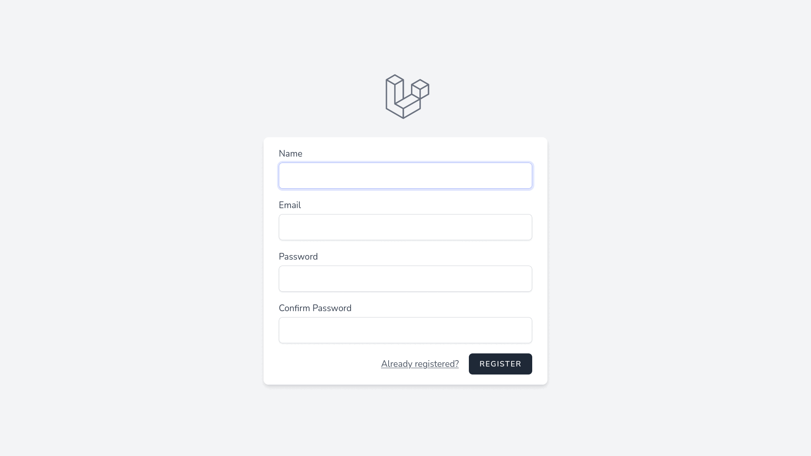

# Wallet

### Assumptions

- Transactions happen between the wallets only in the system
- The balance of a wallet can turn negative
- All transactions are in EUR currency

## Design

- Setup
    - Laravel Sail for setting up Docker container
    - Laravel Breeze with Inertia.js for app scaffolding
    - MariaDB SQL database
    - Min PHP version 7.4
- Backend
    - Use money pattern ([MoneyPHP][moneyphp])
    - Use service objects
    - Use data transfer objects between requests and services
- Routing
    - Inertia.js bridge frontend and backend, route server requests to avoid page reloads
    - CSRF tokens are managed under the hood by axios
- Frontend
    - Vue.js for frontend
    - Tailwindcss for styling
    - Laravel Mix (Webpack) for asset processing
        - BrowserSync for live-reloading during development
    - Laravel Dusk for browser testing using Selenium

[moneyphp]: http://moneyphp.org/

### Tests

- Unit tests (none)
- Feature tests (complete) - covers user stories
- Browser tests (complete) - covers user stories

### Ideas for further development

- Improve user authentication by introducing multi-factor authentication using Laravel Fortify
- Add multiple currency support [1]

[1]: https://moneyphp.org/en/stable/features/currency-conversion.html

## Demo setup

Requirements:
- Docker
- Bash
- Git

```bash
$ git clone https://github.com/Reinis/wallet
$ cd wallet/demo
$ cp ../../.env.example 8.0/.env
```

Edit `demo/8.0/.env` file.

```dotenv
APP_URL=http://wallet.test
APP_PORT=8080

# Necessary when building the Docker image
WWWUSER=1002
WWWGROUP=1002

DB_CONNECTION=mysql
DB_HOST=mariadb
DB_PORT=3306
DB_DATABASE=wallet
DB_USERNAME=sail
DB_PASSWORD=password
```

Start containers from the `demo` folder.

```bash
$ env -S $(cat 8.0/.env | sed 's/#.*//g' | xargs) docker-compose up
```

Go to `http://localhost:8080/register` to create a new user.

## Setup for development with Laravel Sail

Requirements:
- PHP 7.4+
- Composer
- Docker
- Bash
- Git

```bash
$ # Clone the repository
$ git clone git@github.com:Reinis/wallet
$ cd wallet
$ # Set up .env file
$ cp .env.example .env
$ # Install PHP dependencies
$ composer install
$ # Generate encryption key
$ php artisan key:generate
$ # Laravel Sail (Docker), update .env and write docker-compose.yml
$ php artisan sail:install --with=mariadb
$ alias sail='bash vendor/bin/sail'
$ sail up -d
$ # Laravel Mix (JavaScript, CSS)
$ sail npm install
$ # Compile assets (prod, dev or watch)
$ sail npm run dev
$ # Run unit and feature tests
$ sail test
$ # Open browser at localhost
$ # ...
$ # Stop docker services
$ sail down
```

Note: Set `APP_PORT` in the `.env` file if you want the app to run on a specific port.

For browser tests, selenium service has to be added.

```bash
$ php artisan sail:install --with=mariadb,selenium
$ sail up -d
$ # Run browser tests
$ sail dusk
```

## Demo


